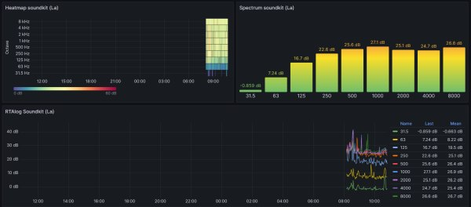

# Workshop Sound Backend
Documentation for the workshop Soundkit backend for meetup of community IoT-Apeldoorn.

# This workshop has beta status.
You are encouraged to test the workshop instructions and provide feedback through issues or pull requests. 

# Workshop instructions
Go to [Workshop instructions](workshop.md) for the workshop. 

When finalised you will see something like this: 

## License
This project is free: You can redistribute it and/or modify it under the terms of a Creative Commons Attribution-NonCommercial 4.0 International License (http://creativecommons.org/licenses/by-nc/4.0/) by IOT Apeldoorn (https://iotapeldoorn.nl/) E-mail: info@iotapeldoorn.nl

 This work is licensed under a <a rel="license" href="http://creativecommons.org/licenses/by-nc/4.0/">Creative Commons Attribution-NonCommercial 4.0 International License</a>.

## Disclaimer
This project is distributed in the hope that it will be useful, but WITHOUT ANY WARRANTY; without even the implied warranty of MERCHANTABILITY or FITNESS FOR A PARTICULAR PURPOSE.
  
