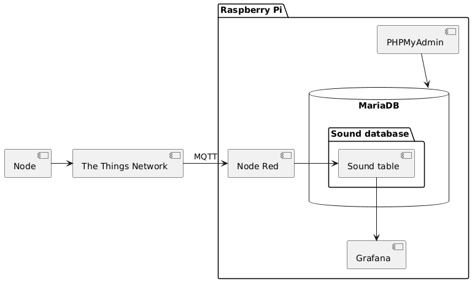

# PlantUML

The component diagram was designed in [PlantUML](//www.plantuml.com/plantuml/png/RP2zReKm38LtFuN5tXVeKD6gKhk0ACs6CfZ6G0GaA0cgKCMxDzpSdplSmOlFv_D9pdqW5zPvWgQqYYK-lM0Z1aOnQDDxB3dyMZTAW8L-HkePivhyqh9p6rOwmp_0HmUfwAZ4cfN4Poo-X3ZOwhCgjbSrQnEP21NaDBs_nKXHe9PyL9ntgHsnivDYXzctNOswOfSKRvvaJLY49fOdOeSqzqcIDn-EEZ8a0NR8sQZuYNy0) using this code: 
```
@startuml
[Node] -> [The Things Network]
package "Raspberry Pi" {
  [The Things Network] -> [Node Red] : MQTT
  [PHPMyAdmin] --> MariaDB
  database "MariaDB" {
    folder "Sound database" {
      [Node Red] -> [Sound table]
    }
  }
  [Sound table] --> [Grafana]
}
@enduml
```

