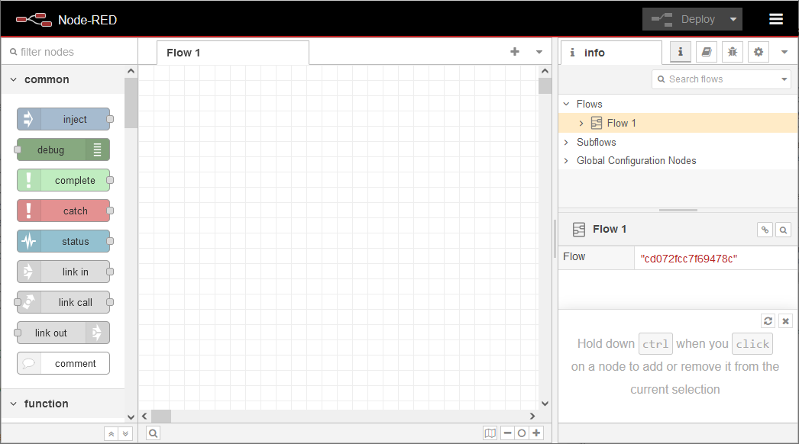
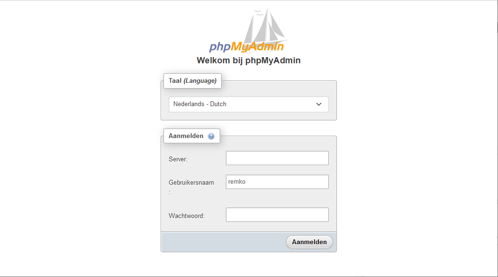
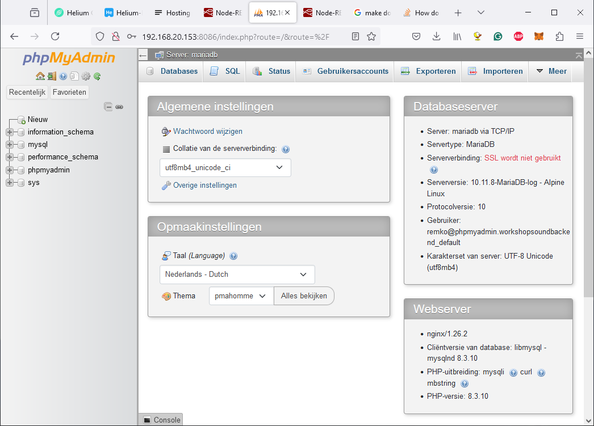
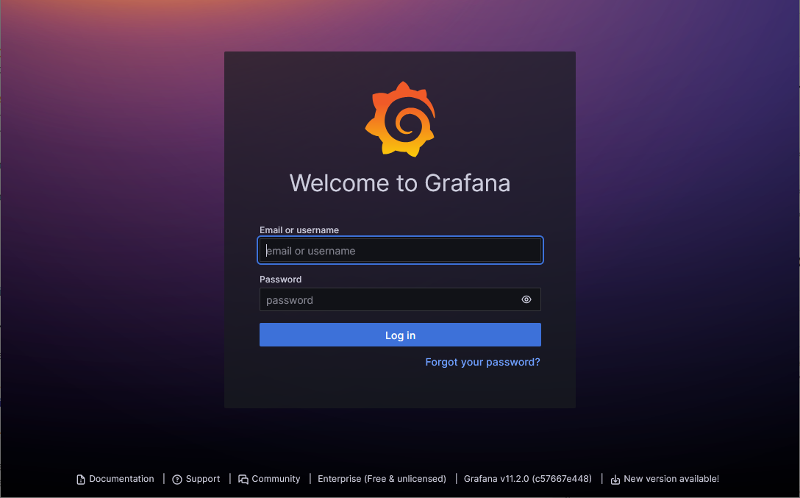
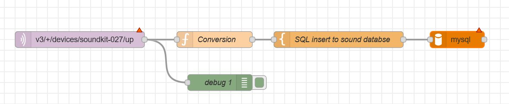

# Kownledge
For this workshop, knowledge of the participant is expected at the level of **intermediate**. This is with respect to the use of Linux, Node-red, MariaDB, and Graphana. 

# License and disclaimer. 
Please note the license at the end of this workshop manual. 

# Required material

 - Laptop (to install the OS on a micro SD card)
 - Raspberry Pi 4 or higher with preferrably 4G RAM or more. 
 - 5V power supply for the selected Raspberry Pi.
 - MicroSD card 32 GB or more. (Do consider using a Extreme XDHC card or equivalent because of wear out due to extensive read-write).
 - UTP network cable to connect to wired internet. 
 - micro-hdmi to hdmi cable to connect to a monitor.
 - A monitor with HDMI. (as an alterative consider a *hdmi to usb adapter* to have your laptop act as a monitor uring the camera app with Windows. These adapters can be puchased from Amazon for less than 9 Euros).
 - USB keyboard.
 
 *Note: Although this readme was developed using a Raspberry Pi 400, compatible minicomputers are likley to be useable. This was not tested.*
 
## Warning:
It is known that some docker containers for this workshop will not work on 32-bit OS. Therefore install only a 64-bit OS for this howto.

## Install OS on micro SD card
More extensive help can be found at [Getting started with your Raspberry Pi](https://www.raspberrypi.com/documentation/computers/getting-started.html).

 1. Install Raspberry Pi Imager; Download ([here](https://www.raspberrypi.com/software/) the latest version) on the OS of your laptop.
 2. With Raspberry Pi Imager select Model, (PI4 or later)
 3. Select the OS: Raspberry Pi OS (Other) --> Raspberry Pi OS Lite (64-bit)
 4. select storage medium: SD-card inserted. 
 5. click next.
 6. Now the installer asks for *OS customisation*. Select *EDIT SETTINGS*.
    - With the first tab (General):
        a. If required, set the *hostname* of your raspberry.
        b. **Set you username and password.** *You may want to write these down somewhere.*
        c. If you want to connect to WiFI, set your SSID and Password. **With this workshop we connect to the WiFi using SSID: xxxx and password: yyyyyy**
        d. If required, set you locale settings: 
           - Time zone: Europe/Amsterdam
           - Keyboard layout: us
    - With the second tab (Services):
        a. Check "Enable SSH".
        b. Check "Password authentication"
 7. When all OS settings are set, choose *YES*.
 8. When the installer warns that all content of the selected media will be erased, **ensure you selected the right media**, and click *YES*.
 9. The installer starts downloading the image and write it to the micoSD card. 
 10. After the installer finalised writing, place the storage-medium in your Raspberry Pi and boot it.
 
## Finalising the installation. 

 1. Login to your raspberry with the user name and credentials provided with step 6b. **Logging in can be done at console or using SSH**. More information about remote access can be found at [Remote control over the local network](https://www.raspberrypi.com/documentation/computers/remote-access.html)
 2. Ensure that you have connection to the network or internet. type `$ ip a` to see the network setting
    currectly active. 
    - with `wlan0` you see a ip-address at `inet` when you are connected and received an ip-address over dhcp. 
    - if the command `$ ping 8.8.8.8` repies with a time in ms, Google dns replies so you have internet access. 
 3. Update the os to the latest version with `$ sudo apt update && sudo apt upgrade -y`.
 4. reboot your Raspberry Pi with the command `$ sudo shutdown -r 0` and you are good to go to the next phase of the workshop. 
 
## Install options. 
Raspberry Pi 4, 400, and 5 are capeable of booting from USB instead of micro USB. Therefore you may decide to write the image to a USB memory stick in the previous instructions. 

To make the Raspberry Pi 4, 400 or 5 boot from USB follow [this tutorial](https://linuxconfig.org/boot-your-raspberry-pi-from-a-usb-a-tutorial). 

### Secure Shell (SSH)
Secure shell or SSH is a safe and easy way to access your Raspberry-Pi over the network and from your own PC. SSH is 
In Paragraph **Install OS on micro SD card** we enabled SSH at 6.

SSH can be used from the command-line of any OS. 

# Install software. 
*Installation of the software can be done in multiple ways. This howto will use Docker compose to streamline installation.*

For this howto, the following software is required:

 - git,
 - docker, docker-compose,
 - Node-Red, MariaDB, PHPMyAdmin, Grafana
 
## Warning. 
Please note that the configuration used in this workshop lack some security measures. Therefore: **Never run this configuration connected to the internet**.
 - All aplications run as root. 
 - User login is configured in Node-Red.
 - MariaDB root password is set to `replaceme`.
 - Grafana has a default password. 
 - No application is configured to be using https.

**Only use this configuration on your local network, behind a firewall.**
 
## Install Git. 
To install git give command `$ sudo apt install git` and type `Y`(es) to continue installing. 
As we are only using git to pull the repository used for this workshop, no further configuration is required. 

## Install Docker.
These instructions are taken from: https://dev.to/elalemanyo/how-to-install-docker-and-docker-compose-on-raspberry-pi-1mo

 1. Install Docker: Docker provides a handy install script for that, just run: `$ curl -fsSL test.docker.com -o get-docker.sh && sh get-docker.sh`
 2. By default, only users who have administrative privileges (root users) can run containers. 
    If you are not logged in as the root, one option is to use the sudo prefix. However, you could also add your non-root user to the Docker group which will allow it to execute docker commands. 
    Run the following command: `$ sudo usermod -aG docker [user_name]` (Replace [user_name] with your username).
    - To verify if you have been added to the `docker` group run `$ groups ${USER}`. The result should contain `docker`.
 3. Reboot the Raspberry Pi to let the changes take effect (or log-out and log-in with the user). Shutting down and rebooting your raspberry can be done with command: `$ sudo shutdown -r now`.
 4. Install Docker-Compose using apt: run command `$ sudo apt install docker-compose`.
 5. Enable the Docker system service to start your containers on boot. Enable Docker service: `$ sudo systemctl enable docker`.
 6. Start Docker now: `$ sudo systemctl start docker`. 
 7. Verify Docker status: `$ sudo systemctl status docker`. You should see `active (running)` if Docker is running. Type `ctrl-c` to exit.
 8. Run Hello World Container. run `$ docker run hello-world`. 
    Once it goes through all the steps, the output should inform you that your installation appears to be working correctly.
    
## Install Node-Red, MariaDB, PHPMyAdmin and Grafana.
The docker containers for this workshop are preconfigured using docker-compose. This file *(docker-compose.yml)* is part of the repository that comes with this workshop. We now have to clone this respository on our Raspberry pi.

 1. login  in your Raspberry Pi. 
 2. Clone the repository for this workshop: `$ git clone https://github.com/TTNApeldoorn/WorkshopSoundBackEnd.git`
 3. Go to the directory with repository you just cloned: `$ cd WorkshopSoundBackEnd`
 4. *Optional: Make some security settings to your applications. See: Appendix, additional suecurity settings.* 
 5. Start the Docker containers with `$ docker-compose up -d`. Now the containers will start as daemon. When the start is successfull a similar result as below will be presented. 
 ```
   $ docker-compose up -d
   Creating network "workshopsoundbackend_default" with the default driver
   Pulling nodered (nodered/node-red:latest)...
   latest: Pulling from nodered/node-red
   cf04c63912e1: Pull complete
   69379ba43125: Pull complete
   fd9c368217ce: Pull complete
   a5d78783036a: Pull complete
   ebdf104d1e8a: Pull complete
   6da589a67dde: Pull complete
   cca3769fa12f: Pull complete
   4f4fb700ef54: Pull complete
   cbd5f0062f33: Pull complete
   041d3da84647: Pull complete
   172a8f25a9da: Pull complete
   061bf29ad236: Pull complete
   b3521e9043d9: Pull complete
   a1f8a6939c37: Pull complete
   20f05b83c3d3: Pull complete
   207c8bd4a00e: Pull complete
   e114b7a0a618: Pull complete
   Digest: sha256:7b635f720d9d1aba676925a93fcf20811bbb62b476752b896177faccb28e5ee9
   Status: Downloaded newer image for nodered/node-red:latest
   Pulling mariadb (lscr.io/linuxserver/mariadb:latest)...
   latest: Pulling from linuxserver/mariadb
   646ff129efa7: Pull complete
   df25a931801a: Pull complete
   c116abe7e7b3: Pull complete
   ec142417d43e: Pull complete
   ef02aa7fa9ff: Pull complete
   9ae179c60632: Pull complete
   50a6cae819b3: Pull complete
   f99beb193855: Pull complete
   Digest: sha256:336907b0ff5bf17b26e6e1aa4bfe39c0cfedc9c3b34e79e4bdec50a908273a56
   Status: Downloaded newer image for lscr.io/linuxserver/mariadb:latest
   Pulling phpmyadmin (lscr.io/linuxserver/phpmyadmin:latest)...
   latest: Pulling from linuxserver/phpmyadmin
   646ff129efa7: Already exists
   df25a931801a: Already exists
   c116abe7e7b3: Already exists
   ec142417d43e: Already exists
   ef02aa7fa9ff: Already exists
   9ae179c60632: Already exists
   9f71d972a377: Pull complete
   69937b3cab0c: Pull complete
   ffabe39a9a83: Pull complete
   53119d10418a: Pull complete
   Digest: sha256:435725b35183fb1ddbe0a2e82d19190833fffcccbc368a4b4b619a09a76e101a
   Status: Downloaded newer image for lscr.io/linuxserver/phpmyadmin:latest
   Pulling grafana (grafana/grafana-enterprise:)...
   latest: Pulling from grafana/grafana-enterprise
   cf04c63912e1: Already exists
   b636826be61c: Pull complete
   fcedf707d489: Pull complete
   d5d0d9dc54a1: Pull complete
   6185471f755b: Pull complete
   28a98c1e0358: Pull complete
   566e937223b0: Pull complete
   d3b0c8e43480: Pull complete
   5a904d27045e: Pull complete
   4dab282a2a74: Pull complete
   Digest: sha256:1283b133d3311bd31de9bb32adfab45e916e9ab6e472020d94a20324912bca80
   Status: Downloaded newer image for grafana/grafana-enterprise:latest
   Creating mariadb    ... done
   Creating grafana    ... done
   Creating phpmyadmin ... done
   Creating nodered    ... done
   ```
 - Type `docker ps` to get a list of all containers installed and their status. When the containers have starte successfully, a similar result as below will be presented:
   ```
   $ docker ps
   CONTAINER ID   IMAGE                                   COMMAND             CREATED              STATUS                        PORTS                                            NAMES
   5b497ab9af04   nodered/node-red:latest                 "./entrypoint.sh"   About a minute ago   Up About a minute (healthy)                                                    nodered
   cacfc5af830e   grafana/grafana-enterprise              "/run.sh"           About a minute ago   Up About a minute             0.0.0.0:3000->3000/tcp, :::3000->3000/tcp        grafana
   f74b2790e3c1   lscr.io/linuxserver/phpmyadmin:latest   "/init"             About a minute ago   Up About a minute             443/tcp, 0.0.0.0:8086->80/tcp, :::8086->80/tcp   phpmyadmin
   a37b37fed71d   lscr.io/linuxserver/mariadb:latest      "/init"             About a minute ago   Up About a minute             0.0.0.0:3306->3306/tcp, :::3306->3306/tcp        mariadb

   ```
 - For a more detailed overview of your docker containers type: `docker-compose top`.

Now the Docker containers are running we can access the individual applications.

## Configure Node-Red, MariaDB, PHPMyAdmin and Grafana.
In the following instructions the ip-address of your Raspberry Pi is presented at `<ip-address>`. The ip-address can be found in console using `ip a`. This command will present a summary of all ethernet interfaces on your Raspberry Pi. As there are at least 6 docker containers the information is cluttered. By sending the output of `ip a` to `grep` we will only display the information we want to see. Type `ip a | grep wlan0` to see only the relevant information of `wlan0`. Replace wlan0 for `eth0` to see th relevant information for the ethernet port. 

In the following example we see that the Raspberry Pi can be reached over WLAN at ip-address: `192.168.0.153`:
```
$ ip a | grep wlan
3: wlan0: <BROADCAST,MULTICAST,UP,LOWER_UP> mtu 1500 qdisc pfifo_fast state UP group default qlen 1000
    inet 192.168.0.153/24 brd 192.168.0.255 scope global dynamic noprefixroute wlan0
```

### Configuring Node-Red
Node-Red can be found at `http://<ip-address>:1880` in your browser. When Node-Red is active the following screen is presented:
 


When you see this screen Node-Red is ready to be used. 

### Configuring MariaDB
MariaDB is accessed at `<ip-address>:3306` and managed using PHPMyAdmin. 

### Configuring PHPMyAdmin
PHPMyAdmin can be found at `http://<ip-address>:8086` in your browser. When PHPMyAdmin is active the following screen is presented:



To login with PHPMyAdmin to MariaDB use the following credentials:
```
   Server: mariaDB
 Username: root
 Password: replaceme
```
A successfull login will present you the management screen of your MariaDB database: 



When you see this screen PHPMyAdmin and MariaDB are ready to be used.

**It is recommened to create a new user and associated password with the same rights as root in MariaDB and disable root after logging-in as this new user.**

### Configuring Grafana.
Grafana can be found at `http://<ip-address>:3000` in your browser. When Grafana is active the following screen is presented:



To login with Grafana use the following credentials:
```
 Username: admin
 Password: admin
```

You are asked to change the password. **Click "Skip" for now** and change it later.

# Starting and stopping your Docker containers
To start the Docker containers type: `$ cd ~/WorkshopSoundBackEnd && docker-compose up -d`. 

To stop the Docker containers type: `$ cd ~/WorkshopSoundBackEnd && docker-compose down`. 

A gracefull shutdown of your Raspberry Pi uses: `$ sudo shutdown -h 0` will result in a clean shutdown of your Docker containers and shutting down your Raspberry-Pi. 

# Building your sound sensor backend
In the following steps we will configure the various components to make a dashboard that will present the values of the soundkit. 

## Architecture
With this workshop the data from the soundkit is retrieved over MQTT from The Things Network with NodeRed. The flow in NodeRed stores the retrieved data in the sound database in MariaDB. Grafana retrieves the data of the soundkit from de sound database in MariaDB and shows it in a dashboard. (See component diagram in the figure below)


## MariaDB
The MariaDB is managed using the Database Management System (DBMS) PHPMyAdmin. To access PHPMyAdmin go to `http://<ip-address>:8086` in your browser and login with your credentials.

 1. Create a user and database named `sound`.
 2. Create a table in the database named `sound`

### Create user and database

Use the following SQL statement to create the user `sound` with password `sound` and a database with the same name:

 1. in PHPMyAdmin go to the SQL-tab and copy and paste the following  SQL statement
 
```
CREATE USER 'sound'@'%' IDENTIFIED BY 'sound';GRANT USAGE ON *.* TO 'sound'@'%' REQUIRE NONE WITH MAX_QUERIES_PER_HOUR 0 MAX_CONNECTIONS_PER_HOUR 0 MAX_UPDATES_PER_HOUR 0 MAX_USER_CONNECTIONS 0;CREATE DATABASE IF NOT EXISTS `sound`;GRANT ALL PRIVILEGES ON `sound`.* TO 'sound'@'%';GRANT ALL PRIVILEGES ON `sound\_%`.* TO 'sound'@'%'; 
```
**Note:** In the case that PHPMyAdmin syntax checker presents a red dot to indicate a syntax error, you may click *layout* button below the text box to correct it.

### Create table
Use the following SQL statement to create the table `sound` in the database with the name `sound`:

```
CREATE TABLE `sound`.`sound` (`id` INT NOT NULL AUTO_INCREMENT , `time` TIMESTAMP NOT NULL , `devid` TEXT NOT NULL , `la_min` FLOAT NOT NULL , `la_max` FLOAT NOT NULL , `la_avg` FLOAT NOT NULL , `la_31_5` FLOAT NOT NULL , `la_63` FLOAT NOT NULL , `la_125` FLOAT NOT NULL , `la_250` FLOAT NOT NULL , `la_500` FLOAT NOT NULL , `la_1000` FLOAT NOT NULL , `la_2000` FLOAT NOT NULL , `la_4000` FLOAT NOT NULL , `la_8000` FLOAT NOT NULL , `lc_min` FLOAT NOT NULL , `lc_max` FLOAT NOT NULL , `lc_avg` FLOAT NOT NULL , `lc_31_5` FLOAT NOT NULL , `lc_63` FLOAT NOT NULL , `lc_125` FLOAT NOT NULL , `lc_250` FLOAT NOT NULL , `lc_500` FLOAT NOT NULL , `lc_1000` FLOAT NOT NULL , `lc_2000` FLOAT NOT NULL , `lc_4000` FLOAT NOT NULL , `lc_8000` FLOAT NOT NULL , `lz_min` FLOAT NOT NULL , `lz_max` FLOAT NOT NULL , `lz_avg` FLOAT NOT NULL , `lz_31_5` FLOAT NOT NULL , `lz_63` FLOAT NOT NULL , `lz_125` FLOAT NOT NULL , `lz_250` FLOAT NOT NULL , `lz_500` FLOAT NOT NULL , `lz_1000` FLOAT NOT NULL , `lz_2000` FLOAT NOT NULL , `lz_4000` FLOAT NOT NULL , `lz_8000` FLOAT NOT NULL , PRIMARY KEY (`id`)) ENGINE = InnoDB; 
```

## Node-Red

### Add the MySQL node
When the MySQL-node is not installed, take these steps to add the node:

 1. Type `alt-shit-P` or 
    a. click on the 3-bars on the top-right of your screen
    b. click on `Manage palette`
 2. Select tab `Install`
 3. in `search modules` type *node-red-node-mysql* and click `install`.
 
### Import flow
For this workshop we have prepared a [flow](flow1.json) that we will import in Node-Red. 

 1. Type `ctrl-i` in Node-Red. The import dialogue will open.
 2. Click **Select a file to import** and browse in the repository to the file named [flow1](flow1.json).
 3. Click **import** 
    - if you are prompted that there are existing nodes, click **Import copy**. 
 4. Click ** Deploy** to activate your configuration. 
    - You are warned that *the workspace contains some nodes that are not properly configured*. We do this in the following steps. Click **Confirm deploy**.
 
### Configure nodes

Now the flow is imported we have to configure the MQTT client and the MySQL-node because there is no MQTT broker and no database configured. This is indicated 



#### MQTT-client node

*Before your execute these steps you have to retrieve the device-id of your sound sensor. This can be done at your application at TTN or with the administrators of IoT-Apeldoorn.*

*In the following instructions replace <your-sound-device-ID> with the device-id of your sound sensor.*

 1. Configure your MQTT-in-node by *dubble-clicking* on it.
 2. Click on **+** to add a new MQTT broker config. 
    a. In tab *Connection* set: 
       - With *Name* set `TTN Soundkit`
       - With *Server* set `eu1.cloud.thethings.network`
    b. in tab * Security*  set:
       - With *Username* set `ttn-soundkit@ttn`
       - With *password* set: `NNSXS.G4OV6FZSVSHDK5LPRIJ2YHEV7FDFP6OS5SKADCI.DDSFJ45U7LMQP3XXFGEAIUBB5PUOIGQRCKBBWWLQ4ZBGTOC75ICA`
       - When ready click `Update` to save your server settings.
 3. Set *Topic* to: `v3/+/devices/<your-sound-device-ID>/up` to see all traffic from all sound sensors.
 4. Set Click **Done** to save your node settings.
 5. Click **Deploy** to activate your changes.
 
#### MySQL node

 1. Configure your MySQL-node by *double-clicking* on it.
 2. Click on **+** to add a new MySQL database.
    - With *name* set `Sound database`
    - With *host* set `127.0.0.1` or `localhost`
    - With *user* set `sound`
    - With *Password* set `sound`
    - With *Database* set `sound`
    - When ready click `Update` to save your server settings.
 3. Set Click **Done** to save your node settings.
 4. Click **Deploy** to activate your changes.

## Grafana

In Grafana we have to add a connection to the database and add dashboards.

### Add connection to database

In Grafana:

 1. To add a new database connection to Grafana click in the menu on the left: Home > Connections > Add new connection.
 2. Search for `MySQL` in the search bar. 
 3. click on **MySQL**.
 4. On the top-right click om **Add new datasource**
 5. Configure the new datasource: 
    - *Name*: `Sound`
    - *Host URL*: `mariadb:3306`
    - Authentication *Username*: `sound` (Same as for your sound database)
    - Authentication *Password*: `sound` (Same as for your sound database)
 6. Click **Save & Test** 
    - When you get `Database Connection OK` you are ready to continue. Else you have to verify your configuration. 

### Importing Dashboards in Grafana

Follow these steps to import the pre-configured dashboards into Grafana. **Note**: Each dashboard must have a unique name and ID (UID) before completing the import.

#### Preparation
 1. **Download the files**: Make sure you have downloaded the following files:
    - **La Dashboard**: [GrafanaDashboardLa.json](GrafanaDashboardLa.json)
    - **Lc Dashboard**: [GrafanaDashboardLc.json](GrafanaDashboardLc.json)
    - **Lz Dashboard**: [GrafanaDashboardLz.json](GrafanaDashboardLz.json)

#### Steps to Import Each Dashboard
 1. **Open Grafana and go to the import function**:
    - In the left-hand menu, click **Home > Dashboards**.
    - In the top right, click **New > Import**.
 2. **Import the dashboard file**:
    - Open one of the downloaded JSON files (for example, `GrafanaDashboardLa.json`).
    - Copy the entire content of the file and paste it into the field labeled *Import via dashboard JSON model* in Grafana.
3. **Load and configure the dashboard**:
    - Click **Load** to proceed with the import.
    - **Set a clear name**: Name the dashboard to reflect its type, such as `Dashboard-La`, `Dashboard-Lc`, or `Dashboard-Lz`, depending on the file you are importing.
    - **Set a unique identifier (UID)**: Click on **Change UID** and enter a unique identifier (for example, `La01`, `Lc01`, `Lz01`). This is required to prevent dashboards from overwriting each other.
4. **Complete the import**:
    - Click **Import** to add the dashboard.
    - **Repeat steps 2 to 4 for each of the three dashboards** (`GrafanaDashboardLa.json`, `GrafanaDashboardLc.json`, and `GrafanaDashboardLz.json`) so each is imported and uniquely identified.

Your new dashboards are now available under **Dashboards** in Grafana and ready for use.

# License
This project is free: You can redistribute it and/or modify it under the terms of a Creative Commons Attribution-NonCommercial 4.0 International License (http://creativecommons.org/licenses/by-nc/4.0/) by IOT Apeldoorn (https://iotapeldoorn.nl/) E-mail: info@iotapeldoorn.nl

<a rel="license" href="http://creativecommons.org/licenses/by-nc/4.0/"></a><br />This work is licensed under a <a rel="license" href="http://creativecommons.org/licenses/by-nc/4.0/">Creative Commons Attribution-NonCommercial 4.0 International License</a>.

# Disclaimer
This project is distributed in the hope that it will be useful, but WITHOUT ANY WARRANTY; without even the implied warranty of MERCHANTABILITY or FITNESS FOR A PARTICULAR PURPOSE.
  
